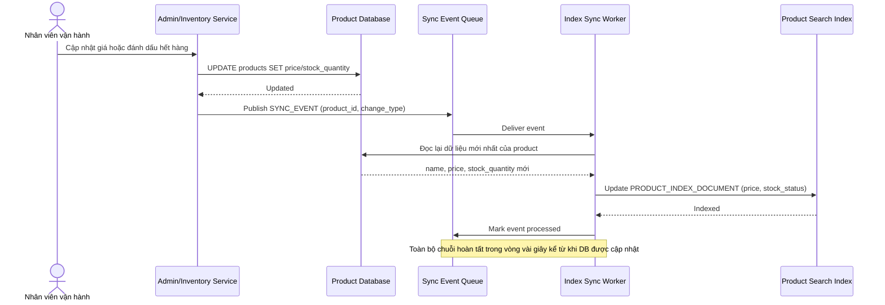

# Sequence Diagram — Enhance: Sync Product to Index

Đây là **enhance**, flow hoàn toàn mới: khi sản phẩm đổi giá hoặc hết hàng trong database chính, thay đổi phải được phản ánh vào search index trong vòng vài giây, tránh hiển thị giá cũ hoặc để khách tìm thấy sản phẩm đã hết hàng mà không có cảnh báo.

