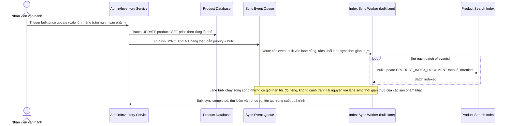

# Sequence Diagram — Enhance: Bulk Update Sync

Đây là **enhance**, flow hoàn toàn mới: khi có cập nhật giá hàng loạt dịp sale lớn ảnh hưởng hàng trăm nghìn sản phẩm, pipeline đồng bộ index phải xử lý mà không làm chậm hoặc downtime cho tìm kiếm đang phục vụ người dùng thật.

