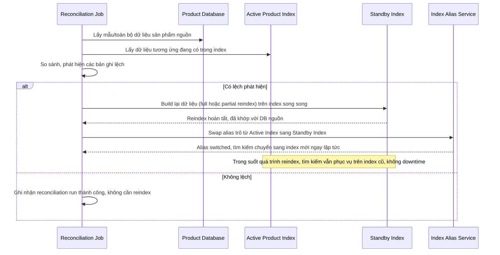

# Sequence Diagram — Enhance: Reindex Reconciliation

Đây là **enhance**, flow hoàn toàn mới: job đối soát định kỳ phát hiện index bị lệch so với database nguồn (do lỗi đồng bộ), tự phục hồi bằng full/partial reindex sang index song song rồi swap alias, không ảnh hưởng tìm kiếm đang chạy.

