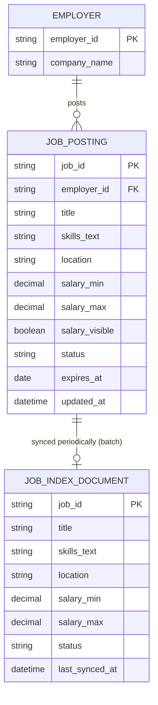

# ERD — Base (trước khi cải thiện độ tươi mới)

Đây là **base**: mô hình dữ liệu suy luận cho nền tảng tuyển dụng *trước khi* cải thiện độ tươi mới của index. Đề bài mô tả nền tảng "đã cho phép" tìm việc theo kỹ năng/địa điểm/mức lương và nhà tuyển dụng đã đăng/đóng tin được — nghĩa là index tìm kiếm đã tồn tại, chỉ là đồng bộ theo chu kỳ định kỳ (batch), chưa tức thời. Đây là điểm base cần có để yêu cầu "tin đóng phải biến mất ngay lập tức" có nghĩa.

