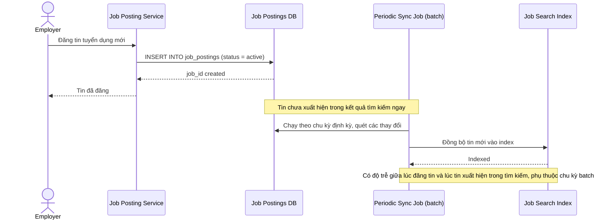

# Sequence Diagram — Base: Post Job

Đây là **base**, flow "đăng tin tuyển dụng" — cho thấy tin mới chỉ vào index sau chu kỳ đồng bộ định kỳ (batch), là tiền đề cho vấn đề độ trễ mà enhance phải giải quyết ở cả chiều đăng lẫn chiều đóng tin.

