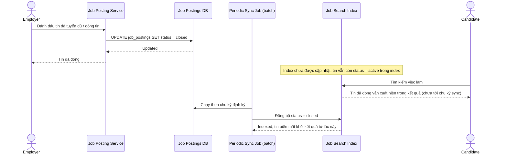

# Sequence Diagram — Base: Close Job

Đây là **base**, flow "đóng tin đã tuyển đủ" — vấn đề cốt lõi mà enhance phải giải quyết: tin bị đóng trong DB nhưng vẫn hiển thị trong kết quả tìm kiếm cho tới chu kỳ đồng bộ định kỳ kế tiếp, khiến ứng viên vẫn nộp hồ sơ vào tin đã đóng.

