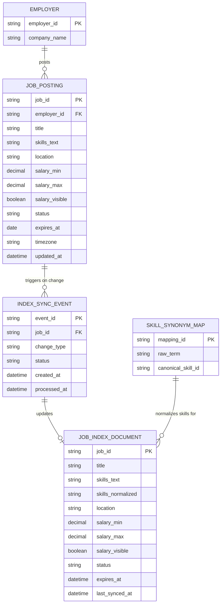

# ERD — Enhance (sau khi cải thiện độ tươi mới)

Đây là **enhance**: ERD base cộng với `SKILL_SYNONYM_MAP` để ánh xạ các cách gõ kỹ năng khác nhau về cùng khái niệm, và `JOB_INDEX_DOCUMENT` được bổ sung cơ chế đồng bộ sự kiện tức thời thay vì batch định kỳ. So với base, việc đồng bộ index không còn qua `Periodic Sync Job` mà qua `INDEX_SYNC_EVENT` được xử lý gần như ngay lập tức, và `JOB_INDEX_DOCUMENT` có thêm `skills_normalized` để phục vụ autocomplete theo tên kỹ năng chuẩn.

