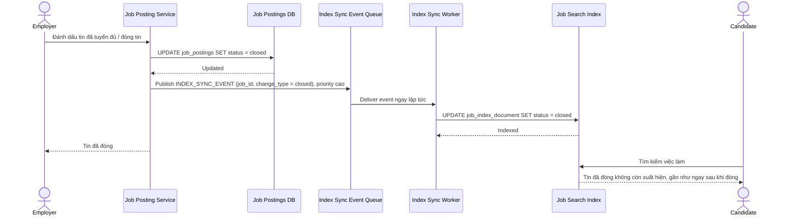

# Sequence Diagram — Enhance: Close Job

Đây là **enhance**, flow "đóng tin" đã tồn tại ở base ([3-base-close-job-sqd.md](3-base-close-job-sqd.md)) nay thay đổi cốt lõi: thay vì chờ chu kỳ batch, việc đóng tin phát ngay `INDEX_SYNC_EVENT` và index được cập nhật tức thời, để tin biến mất khỏi kết quả tìm kiếm ngay lập tức.

