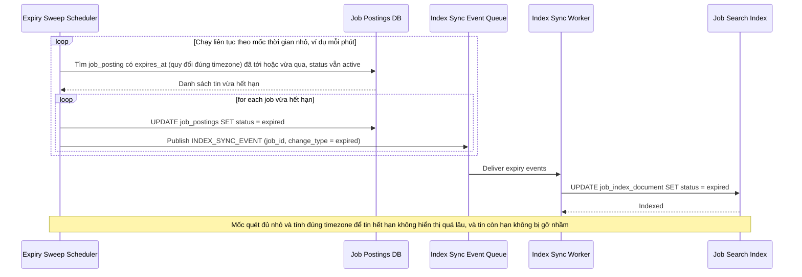

# Sequence Diagram — Enhance: Job Expiry Sweep

Đây là **enhance**, flow hoàn toàn mới: tin có ngày hết hạn phải tự động bị gỡ khỏi index đúng thời điểm hết hạn, xử lý đúng múi giờ, mà không cần nhà tuyển dụng thao tác.

