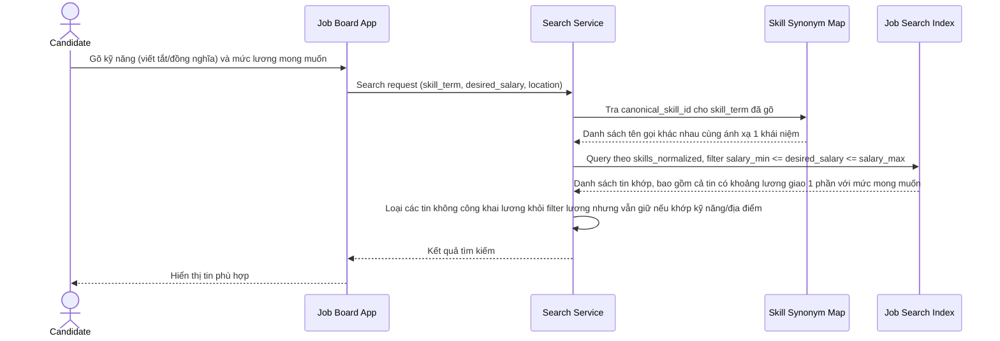

# Sequence Diagram — Enhance: Search Jobs

Đây là **enhance**, flow tìm kiếm việc làm hoàn toàn mới so với base (base chưa mô tả chi tiết cách lọc): xử lý lọc theo khoảng lương (giao khoảng, kể cả tin không công khai lương), và autocomplete kỹ năng ánh xạ qua `SKILL_SYNONYM_MAP` để không bỏ lỡ tin dùng cách gõ khác.

