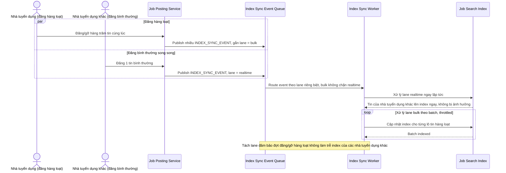

# Sequence Diagram — Enhance: Bulk Post Jobs

Đây là **enhance**, flow hoàn toàn mới: khi 1 công ty đăng hoặc gỡ hàng loạt tin cùng lúc, pipeline index phải xử lý đợt thay đổi lớn này mà không làm chậm việc cập nhật index cho các tin đăng bình thường của nhà tuyển dụng khác đang diễn ra song song.

