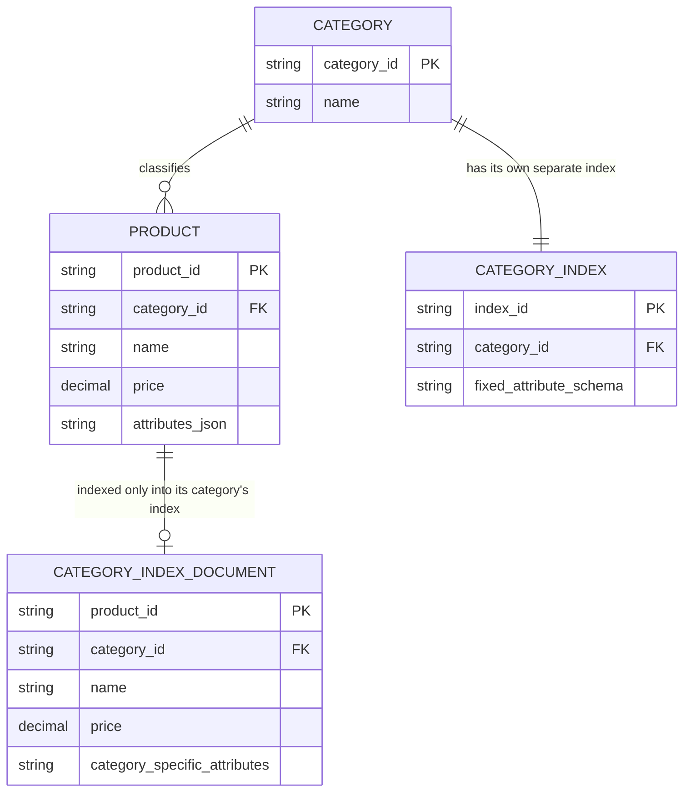

# ERD — Base (trước khi hợp nhất index đa category)

Đây là **base**: mô hình dữ liệu suy luận cho marketplace *trước khi* hợp nhất facet đa category. Đề bài chỉ ra điểm cần tránh là "phải tạo index riêng biệt cho từng category gây khó khăn khi tìm xuyên category" — suy ra base chính là trạng thái đó: mỗi category có 1 index riêng với schema thuộc tính cố định cho category đó, khiến tìm xuyên category khó khăn. Đây là tiền đề để yêu cầu "index thống nhất, schema thuộc tính động" có nghĩa.

