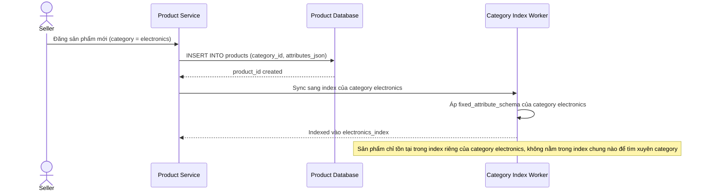

# Sequence Diagram — Base: Index Product

Đây là **base**, flow "lập chỉ mục sản phẩm" khi mỗi category có 1 index riêng biệt — tiền đề cho thấy hạn chế: sản phẩm chỉ được index vào đúng 1 index của category nó thuộc về, theo schema cố định của category đó.

