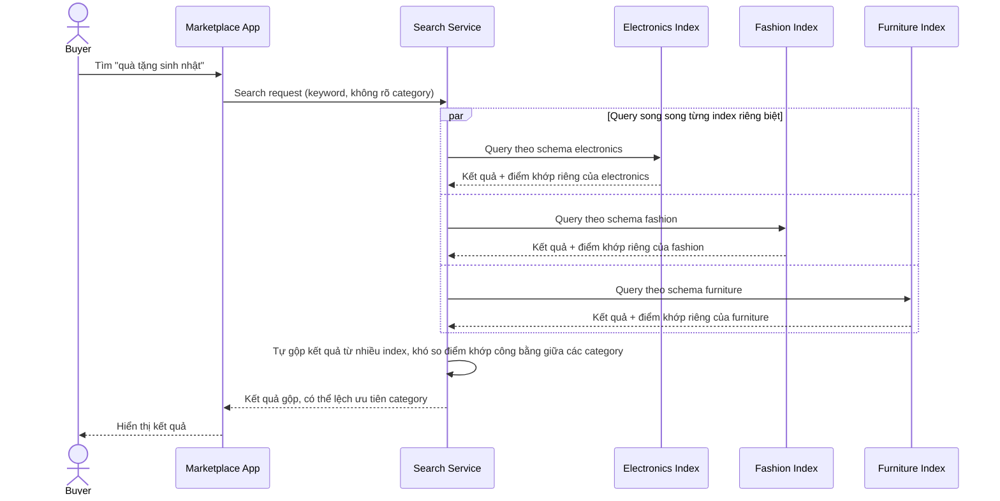

# Sequence Diagram — Base: Search Product

Đây là **base**, flow "tìm kiếm sản phẩm" khi mỗi category có index riêng — cho thấy rõ vấn đề: tìm trong 1 category hoạt động tốt, nhưng tìm xuyên nhiều category (ví dụ "quà tặng sinh nhật") phải query nhiều index riêng lẻ rồi tự gộp kết quả, khó xếp hạng công bằng.

