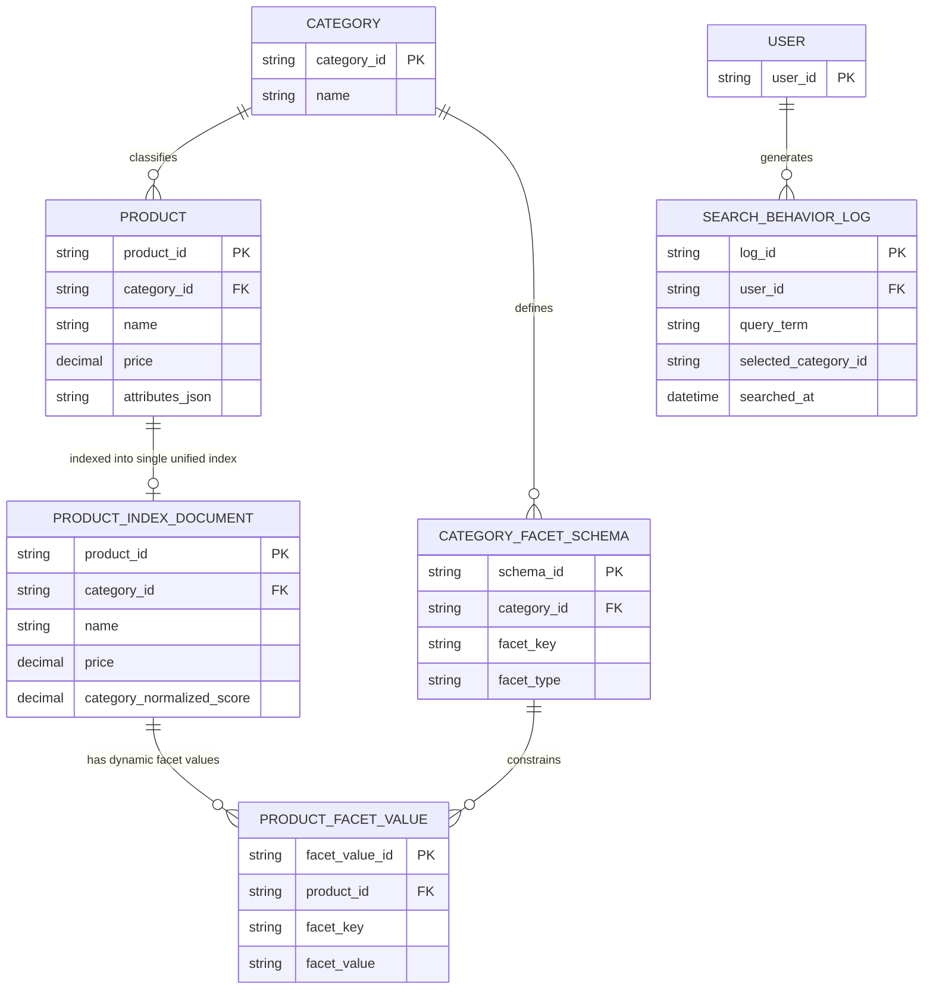

# ERD — Enhance (sau khi hợp nhất index đa category)

Đây là **enhance**: thay vì mỗi category 1 index riêng (base), nay chỉ còn 1 `PRODUCT_INDEX` thống nhất với schema thuộc tính động qua `PRODUCT_FACET_VALUE` (mô hình EAV), mỗi category định nghĩa facet của mình qua `CATEGORY_FACET_SCHEMA` mà không cần đổi cấu trúc index. Thêm `SEARCH_BEHAVIOR_LOG` phục vụ suy luận ngữ cảnh category cho autocomplete từ khóa mơ hồ.

