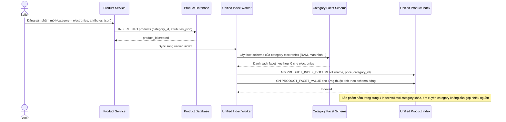

# Sequence Diagram — Enhance: Index Product

Đây là **enhance**, flow "lập chỉ mục sản phẩm" đã tồn tại ở base ([2-base-index-product-sqd.md](2-base-index-product-sqd.md)) nay thay đổi cốt lõi: sản phẩm được index vào duy nhất 1 `PRODUCT_INDEX` thống nhất, thuộc tính riêng của category được lưu dưới dạng `PRODUCT_FACET_VALUE` động tra theo `CATEGORY_FACET_SCHEMA`, không cần index riêng biệt cho từng category.

