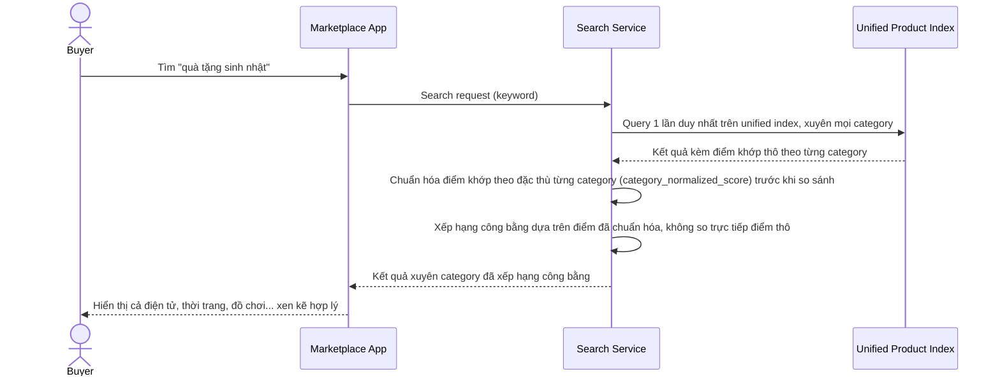

# Sequence Diagram — Enhance: Search Product

Đây là **enhance**, flow "tìm kiếm sản phẩm" đã tồn tại ở base ([3-base-search-product-sqd.md](3-base-search-product-sqd.md)) nay thay đổi cốt lõi: chỉ 1 query duy nhất trên unified index thay vì query song song nhiều index riêng, và điểm khớp được chuẩn hóa theo đặc thù từng category trước khi so sánh, đảm bảo xếp hạng công bằng xuyên category.

