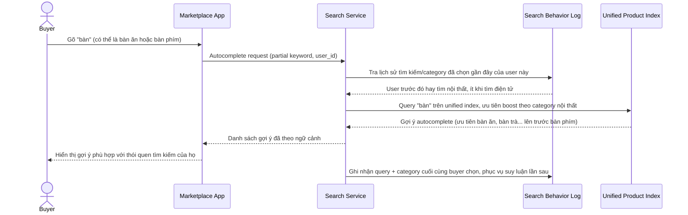

# Sequence Diagram — Enhance: Autocomplete Ambiguous Term

Đây là **enhance**, flow hoàn toàn mới: khi từ khóa gõ vào có thể thuộc nhiều category (ví dụ "bàn"), autocomplete suy luận ngữ cảnh category phù hợp dựa trên hành vi tìm kiếm/lịch sử của người dùng, tránh gợi ý lẫn lộn.

