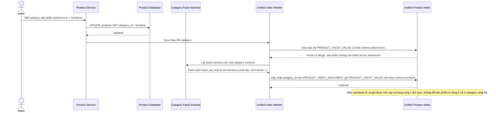

# Sequence Diagram — Enhance: Change Product Category

Đây là **enhance**, flow hoàn toàn mới: khi người bán đổi category của sản phẩm sau khi đã đăng, index phải cập nhật đồng thời danh mục lẫn bộ facet thuộc tính tương ứng, đảm bảo sản phẩm không còn xuất hiện ở facet của category cũ.

