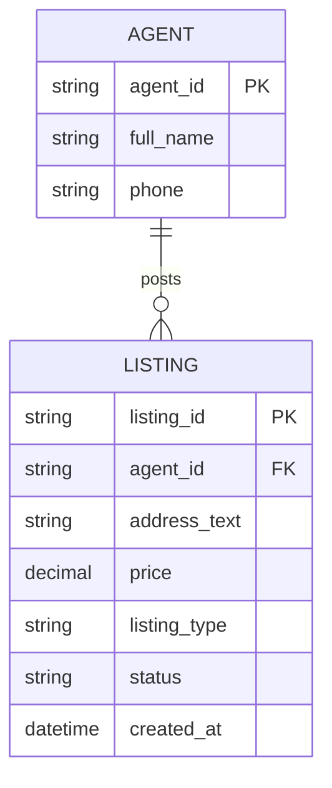

# ERD — Base (trước khi có tìm kiếm theo bản đồ)

Đây là **base**: mô hình dữ liệu suy luận cho nền tảng bất động sản *trước khi* có tìm kiếm theo bản đồ/autocomplete địa chỉ. Đề bài mô tả toàn bộ khả năng bản đồ/autocomplete là nội dung của enhance, nên base được suy luận là trạng thái trước đó: tin đăng chỉ có địa chỉ dạng text tự do, tìm kiếm theo bộ lọc cơ bản (giá, loại tin), chưa có tọa độ hay index địa lý.

