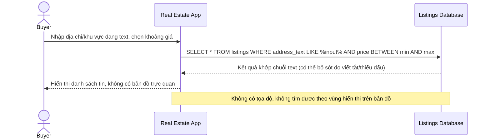

# Sequence Diagram — Base: Search Listing

Đây là **base**, flow "tìm tin bất động sản" bằng bộ lọc cơ bản (giá, loại tin, khớp chuỗi địa chỉ text) — tiền đề cho thấy hạn chế: không có khả năng tìm theo vùng bản đồ hay autocomplete địa chỉ chuẩn hóa, phải gõ đúng định dạng địa chỉ mới ra kết quả.

