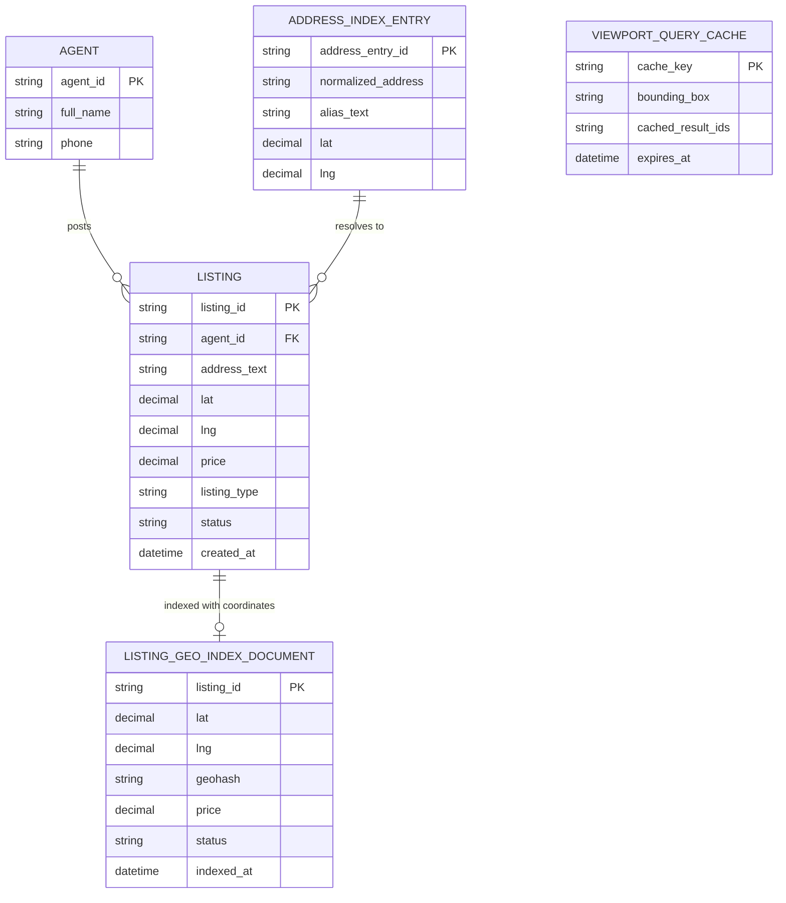

# ERD — Enhance (sau khi có tìm kiếm theo bản đồ)

Đây là **enhance**: `LISTING` được bổ sung tọa độ `lat`/`lng`, thêm `LISTING_GEO_INDEX_DOCUMENT` phục vụ query vùng bản đồ hiệu quả, `ADDRESS_INDEX_ENTRY` phục vụ autocomplete địa chỉ chuẩn hóa, và `VIEWPORT_QUERY_CACHE` để trả kết quả nhanh khi zoom/pan liên tục. So với base, tìm kiếm không còn dựa trên `address_text` khớp chuỗi mà dựa trên tọa độ và index địa lý chuyên dụng.

