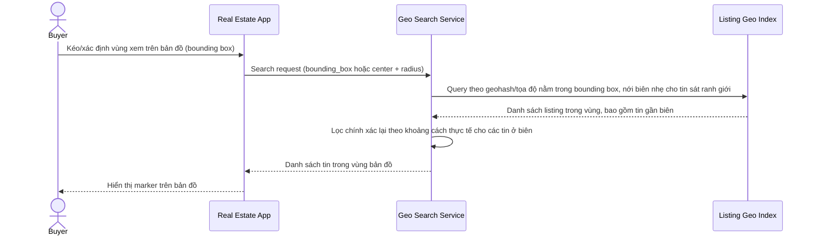

# Sequence Diagram — Enhance: Search by Map Region

Đây là **enhance**, flow hoàn toàn mới: tìm kiếm theo vùng hiển thị trên bản đồ (bounding box/bán kính), trả đúng và đủ tin trong vùng kể cả các tin ở gần đúng ranh giới quận/khu vực.

