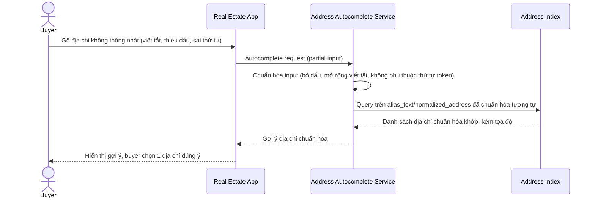

# Sequence Diagram — Enhance: Autocomplete Address

Đây là **enhance**, flow hoàn toàn mới: autocomplete xử lý địa chỉ viết tắt/thiếu dấu/thứ tự phường-quận-thành phố khác nhau, gợi ý đúng địa chỉ chuẩn hóa mà không cần người dùng gõ chính xác định dạng đầy đủ.

