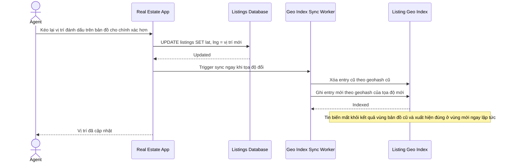

# Sequence Diagram — Enhance: Update Listing Location

Đây là **enhance**, flow hoàn toàn mới: khi người đăng tin sửa lại tọa độ/vị trí trên bản đồ cho chính xác hơn, index phải cập nhật ngay để tin xuất hiện đúng vùng mới và biến mất khỏi vùng cũ.

