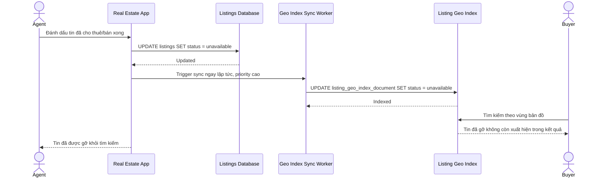

# Sequence Diagram — Enhance: Mark Listing Unavailable

Đây là **enhance**, flow hoàn toàn mới: tin đã cho thuê/bán xong phải bị gỡ khỏi kết quả tìm kiếm theo bản đồ ngay lập tức, tránh người tìm liên hệ vào tin không còn hiệu lực.

