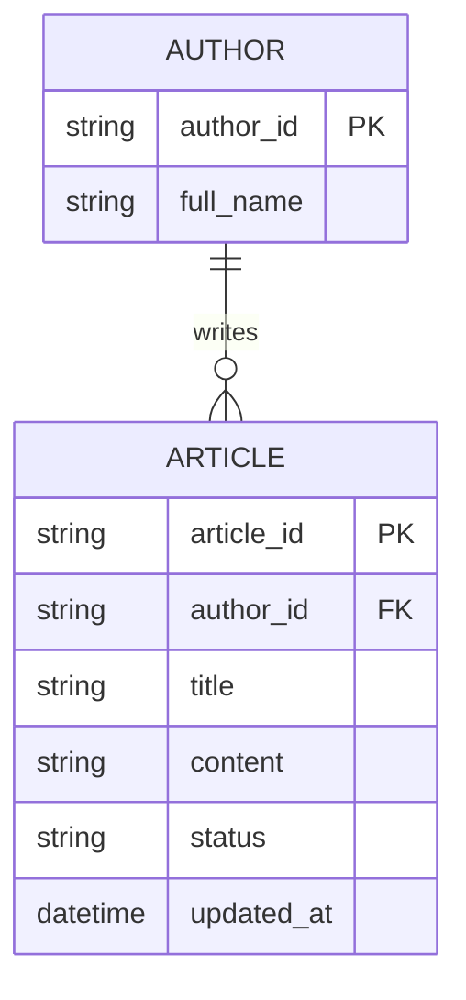

# ERD — Base (trước khi có tìm kiếm ngữ nghĩa)

Đây là **base**: mô hình dữ liệu suy luận cho help center *trước khi* có tìm kiếm ngữ nghĩa. Đề bài giả định đã có `ARTICLE` do đội support/docs chỉnh sửa, có trạng thái nháp/xuất bản, và tìm kiếm hiện tại chỉ khớp từ khóa thuần túy trên tiêu đề/nội dung — nếu không có sẵn các bài viết và cơ chế publish này thì yêu cầu "xếp hạng theo ngữ nghĩa" sẽ không có nghĩa.

