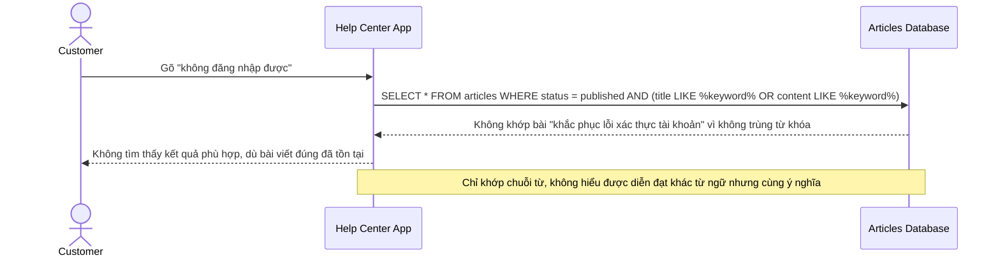

# Sequence Diagram — Base: Search Articles

Đây là **base**, flow "tìm bài viết trợ giúp" bằng khớp từ khóa thuần túy — tiền đề cho thấy hạn chế: khách hỏi "không đăng nhập được" sẽ không tìm ra bài "khắc phục lỗi xác thực tài khoản" vì không có từ nào trùng khớp.

