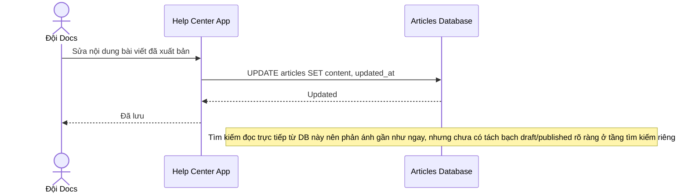

# Sequence Diagram — Base: Publish Article

Đây là **base**, flow "đội docs chỉnh sửa/xuất bản bài viết" — tiền đề cho enhance: mọi thay đổi nội dung diễn ra trên `ARTICLE`, và cần có index riêng đồng bộ gần như ngay lập tức từ đây để tránh hiển thị nội dung lỗi thời hoặc bài nháp.

