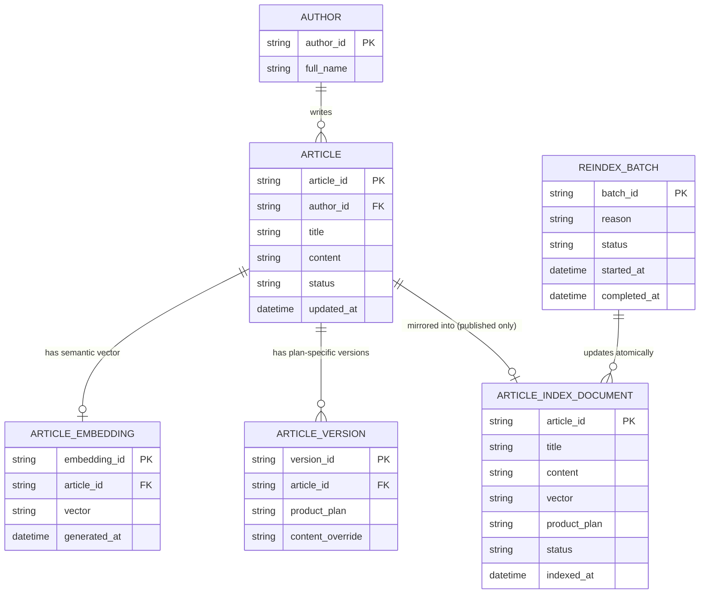

# ERD — Enhance (sau khi có tìm kiếm ngữ nghĩa)

Đây là **enhance**: thêm `ARTICLE_EMBEDDING` (vector ngữ nghĩa) và `ARTICLE_INDEX_DOCUMENT` (index tìm kiếm riêng, tách khỏi DB nguồn) để trả kết quả nhanh mà vẫn xếp hạng theo ngữ nghĩa, `ARTICLE_VERSION` cho các phiên bản theo gói/sản phẩm khác nhau, và `REINDEX_BATCH` cho sửa hàng loạt. So với base, tìm kiếm không còn query trực tiếp DB mà qua `ARTICLE_INDEX_DOCUMENT`, và trạng thái draft/removed được lọc cứng ngay ở tầng ghi index chứ không chỉ ở tầng query.

