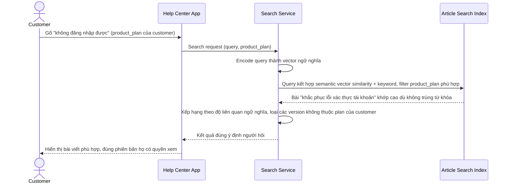

# Sequence Diagram — Enhance: Search Articles

Đây là **enhance**, flow "tìm bài viết" đã tồn tại ở base ([2-base-search-articles-sqd.md](2-base-search-articles-sqd.md)) nay thay đổi cốt lõi: query qua embedding để xếp hạng theo ngữ nghĩa thay vì chỉ khớp từ khóa, đồng thời lọc đúng phiên bản theo gói sản phẩm khách hàng đang dùng, mà không làm chậm đáng kể thời gian trả kết quả.

