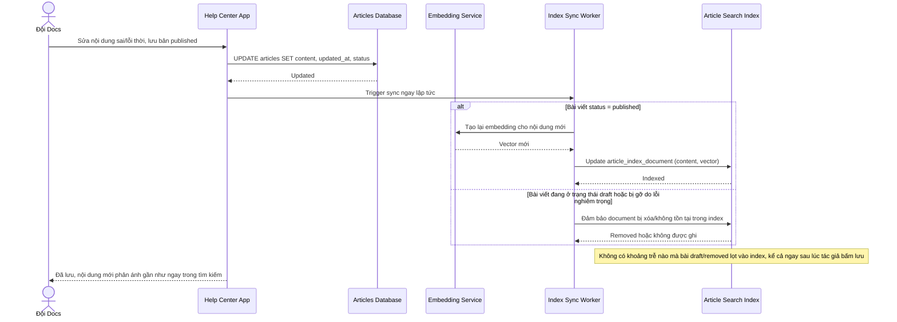

# Sequence Diagram — Enhance: Publish Article

Đây là **enhance**, flow "chỉnh sửa/xuất bản bài viết" đã tồn tại ở base ([3-base-publish-article-sqd.md](3-base-publish-article-sqd.md)) nay thay đổi: mỗi thay đổi phát sinh cập nhật `ARTICLE_INDEX_DOCUMENT` gần như ngay lập tức, và bài nháp/bị gỡ do lỗi nghiêm trọng không bao giờ lọt vào index kể cả trong khoảng thời gian ngắn xử lý.

