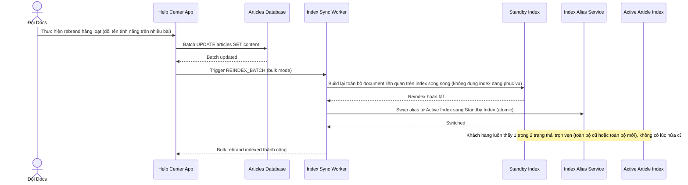

# Sequence Diagram — Enhance: Bulk Rebrand Articles

Đây là **enhance**, flow hoàn toàn mới: khi đội docs sửa hàng loạt bài viết cùng lúc (đổi tên tính năng, rebrand), pipeline index phải cập nhật atomic, không để khoảng thời gian index ở trạng thái nửa cũ nửa mới hiển thị lẫn lộn cho các khách hàng khác nhau.

