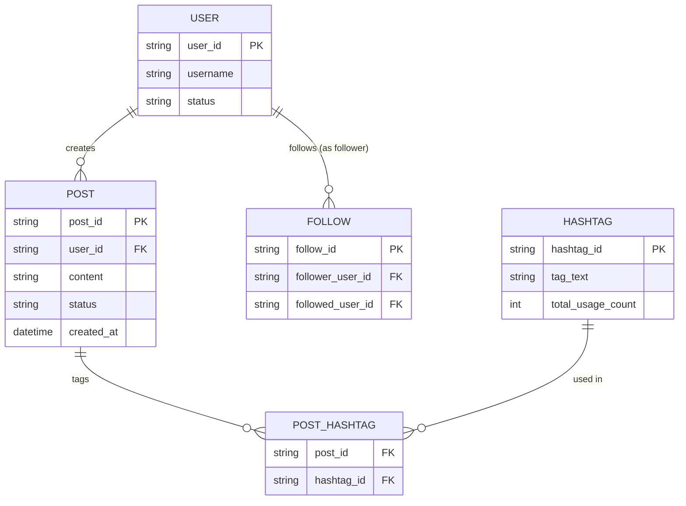

# ERD — Base (trước khi có index thời gian thực)

Đây là **base**: mô hình dữ liệu suy luận cho mạng xã hội *trước khi* có pipeline index gần thời gian thực. Đề bài giả định đã có `USER`, `POST` (có thể chứa `HASHTAG` trích xuất từ nội dung), và quan hệ `FOLLOW` giữa người dùng — đây là dữ liệu nền bắt buộc để "tìm kiếm người dùng/hashtag/bài viết kèm cá nhân hóa theo follow" có nghĩa. Tìm kiếm ở base được suy luận là chạy trên index đồng bộ theo lô định kỳ, chưa đáp ứng được yêu cầu gần thời gian thực.

