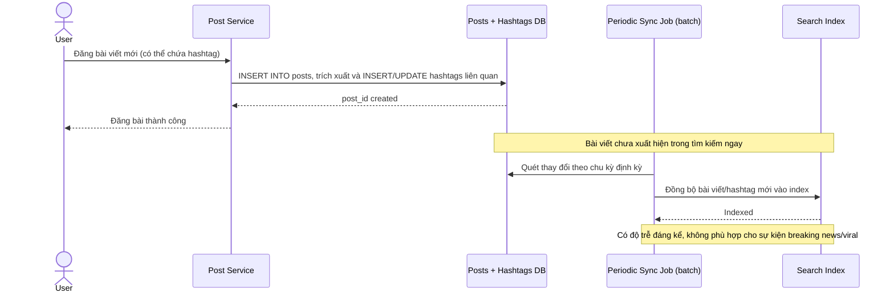

# Sequence Diagram — Base: Create Post

Đây là **base**, flow "đăng bài viết" khi index chỉ đồng bộ theo lô định kỳ — tiền đề cho thấy hạn chế: bài mới không xuất hiện ngay trong tìm kiếm, không phù hợp cho sự kiện đang nóng cần gần thời gian thực.

