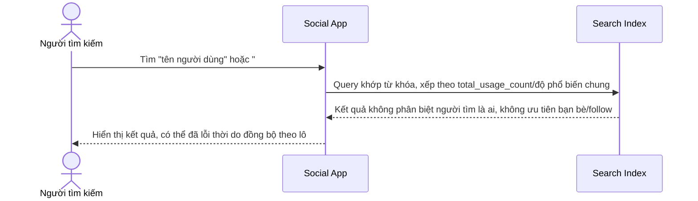

# Sequence Diagram — Base: Search Basic

Đây là **base**, flow tìm kiếm cơ bản trên index đồng bộ theo lô — chưa có cá nhân hóa theo follow, chưa có trending theo tốc độ tăng trưởng, chỉ xếp hạng theo độ phổ biến tổng/khớp từ khóa đơn thuần.

