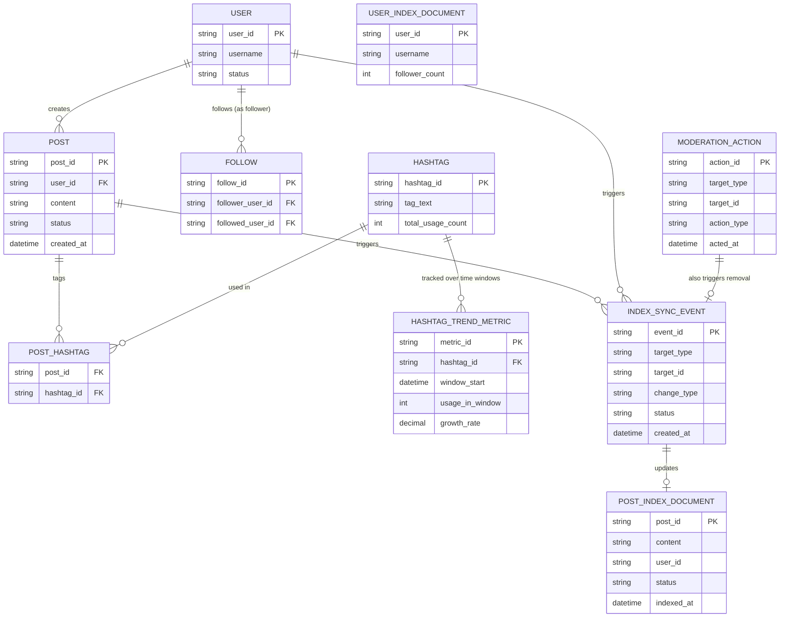

# ERD — Enhance (sau khi có index gần thời gian thực)

Đây là **enhance**: thêm `HASHTAG_TREND_METRIC` tính theo cửa sổ thời gian (growth rate) thay vì tổng lượt dùng lịch sử, `MODERATION_ACTION` đồng bộ việc gỡ nội dung vi phạm vào index ngay lập tức, và `INDEX_SYNC_EVENT` thay cho batch sync để đạt độ trễ gần thời gian thực. So với base, `POST_INDEX_DOCUMENT`/`USER_INDEX_DOCUMENT` được cập nhật qua event-driven pipeline chịu tải ghi lớn, không còn phụ thuộc chu kỳ batch.

