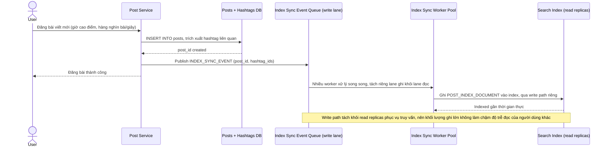

# Sequence Diagram — Enhance: Create Post

Đây là **enhance**, flow "đăng bài viết" đã tồn tại ở base ([2-base-create-post-sqd.md](2-base-create-post-sqd.md)) nay thay đổi cốt lõi: thay vì chờ batch sync, bài viết phát `INDEX_SYNC_EVENT` được xử lý gần thời gian thực, và pipeline phải chịu được khối lượng ghi hàng nghìn bài/giây mà không làm chậm độ trễ đọc của các truy vấn tìm kiếm khác đang chạy song song.

