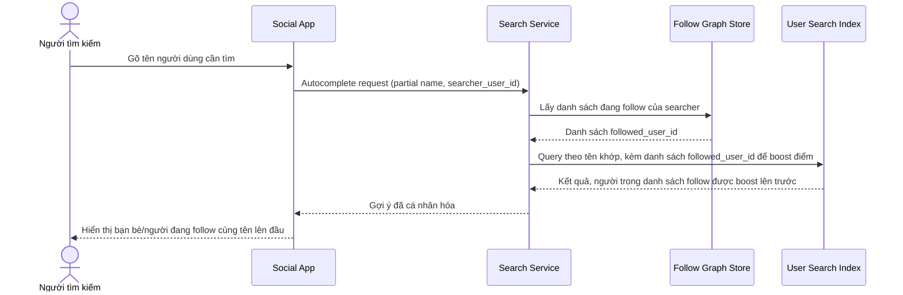

# Sequence Diagram — Enhance: Search User Autocomplete

Đây là **enhance**, flow hoàn toàn mới: autocomplete tìm người dùng cá nhân hóa theo mối quan hệ follow của người tìm, ưu tiên bạn bè/người đang follow lên trước người lạ cùng tên thay vì chỉ xếp theo độ phổ biến chung.

