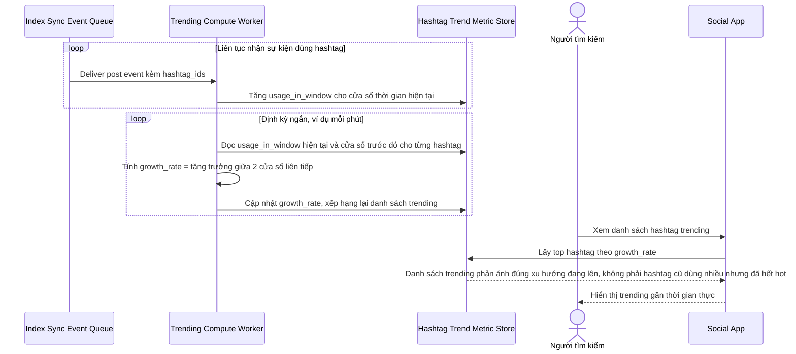

# Sequence Diagram — Enhance: Compute Trending Hashtags

Đây là **enhance**, flow hoàn toàn mới: hashtag trending được tính gần thời gian thực dựa trên tốc độ tăng trưởng sử dụng trong cửa sổ thời gian ngắn, thay vì tổng lượt dùng lịch sử, để tránh hashtag cũ dùng nhiều nhưng đã hết hot vẫn đứng đầu.

