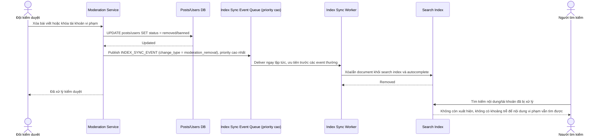

# Sequence Diagram — Enhance: Moderate Content Removal

Đây là **enhance**, flow hoàn toàn mới: khi bài viết/tài khoản bị xóa hoặc khóa do vi phạm chính sách, nội dung phải biến mất khỏi kết quả tìm kiếm và autocomplete ngay lập tức, đồng bộ với hành động kiểm duyệt.

