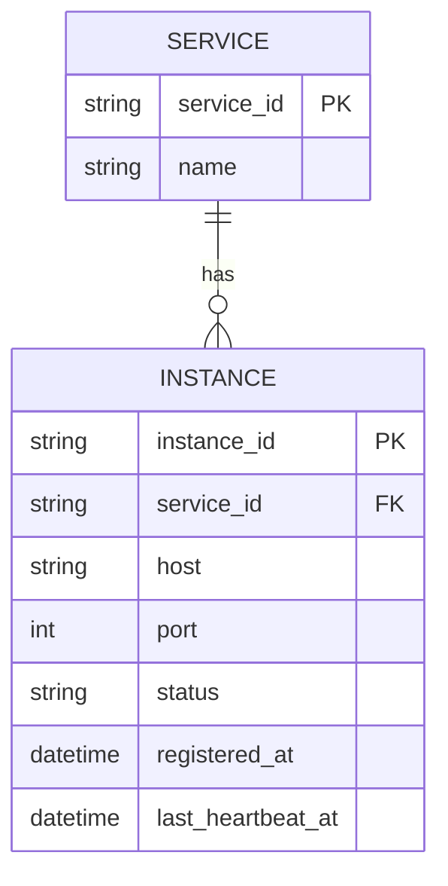

# ERD — Base (trước khi có service discovery đa vùng)

Đây là **base**: mô hình dữ liệu suy luận cho hệ thống thanh toán *trước khi* có yêu cầu service discovery đa vùng. Đề bài giả định hệ thống đã có sẵn một registry đơn giản để service tự đăng ký và client discover instance — nếu không có registry/instance nào tồn tại thì "ưu tiên route cùng region, fallback sang region khác" sẽ không có nghĩa. ERD base chưa có khái niệm region.

