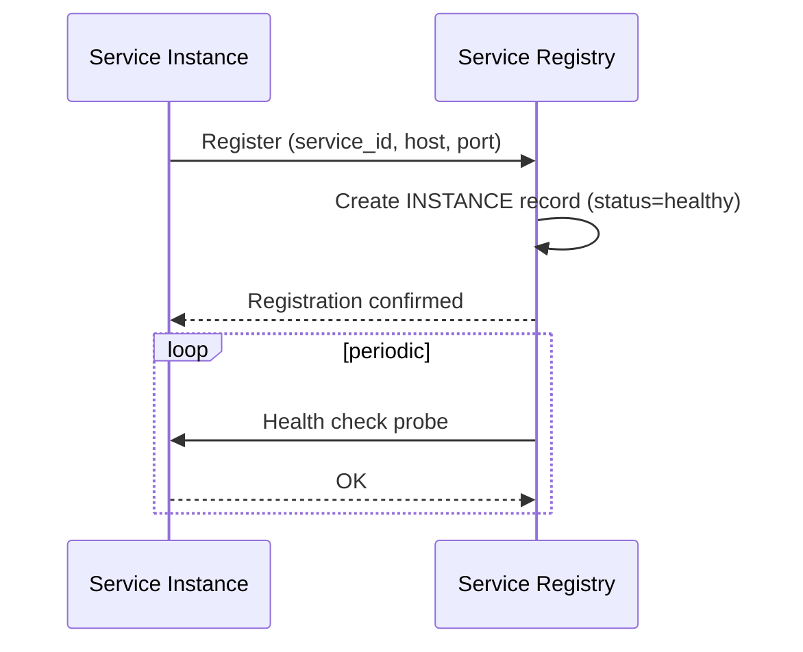

# Sequence Diagram — Base: Register Instance

Đây là **base**, flow một instance tự đăng ký vào registry khi khởi động và định kỳ được health check — tiền đề bắt buộc để sau này registry có dữ liệu instance mà gắn thêm metadata region.

