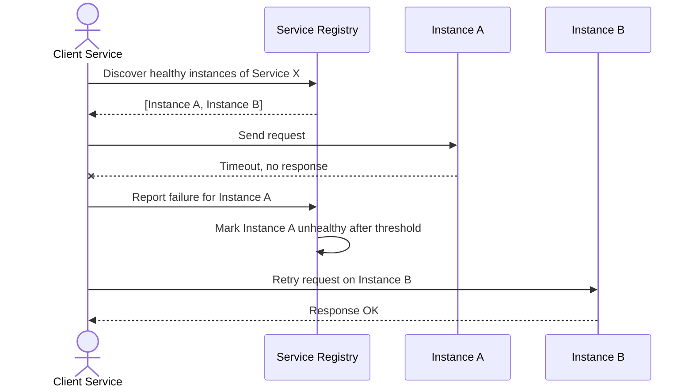

# Sequence Diagram — Base: Route Request

Đây là **base**, flow client discover instance qua registry và route request, đánh dấu instance unhealthy khi gọi thất bại — đây chính là flow sẽ được mở rộng thêm logic ưu tiên cùng region và fallback cross-region ở enhance.

