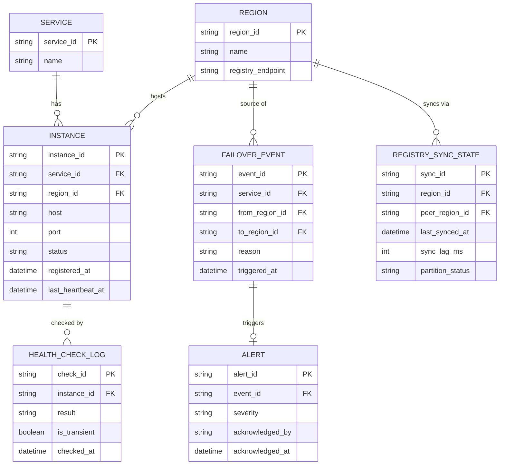

# ERD — Enhance (sau khi có service discovery đa vùng)

Đây là **enhance**: ERD base cộng với các entity phục vụ đúng yêu cầu đề bài — metadata region cho mỗi instance, phân biệt lỗi tạm thời với lỗi thật (tránh flapping), cross-region failover kèm alert và đánh dấu request, và theo dõi trạng thái đồng bộ/partition giữa hai registry. So với base, `INSTANCE` nay có thêm `region_id`, và mọi quyết định route phải đi qua các entity mới này thay vì chỉ dựa trên status nhị phân.

