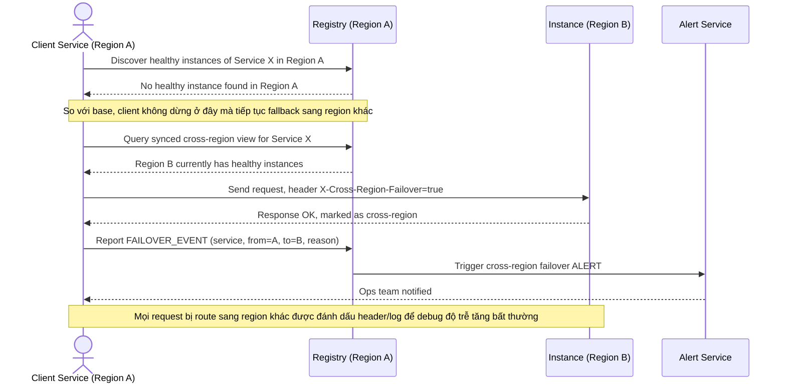

# Sequence Diagram — Enhance: Route Request

Đây là **enhance**, flow route request đã đổi tên vẫn giữ nguyên nhưng logic thay đổi hoàn toàn so với base: client giờ ưu tiên tìm instance healthy trong cùng region, chỉ fallback sang region khác khi region hiện tại hết instance healthy, đồng thời request bị route cross-region phải được đánh dấu (header/log) và tạo alert cho ops.

