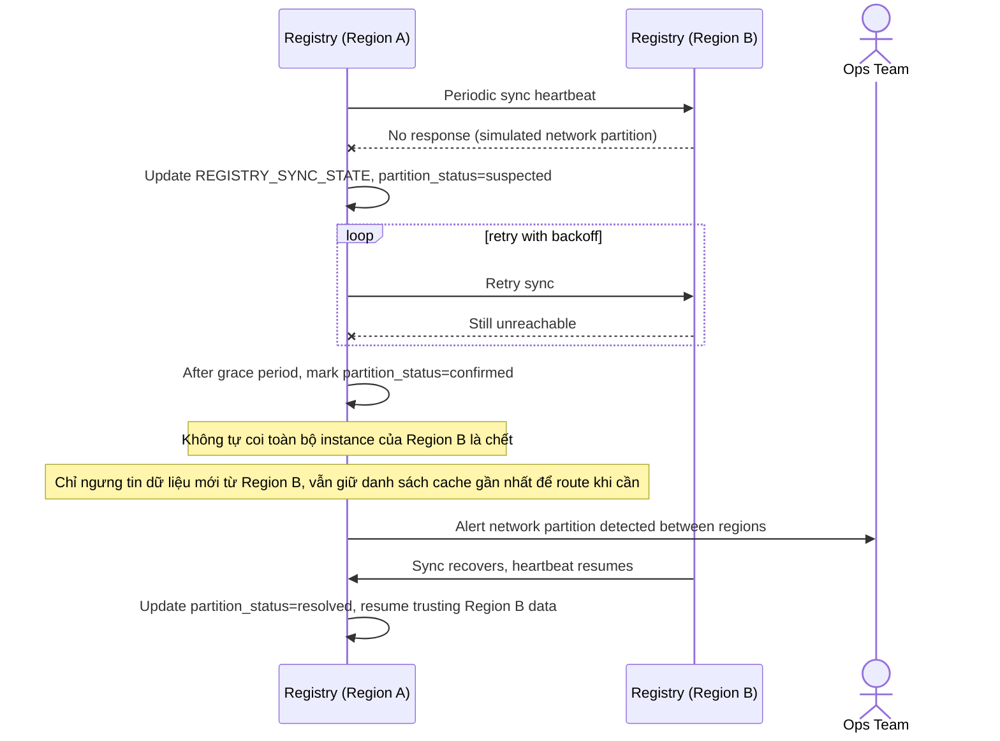

# Sequence Diagram — Enhance: Handle Network Partition

Đây là **enhance**, flow hoàn toàn mới mô phỏng network partition giữa hai registry — yêu cầu đề bài rằng hệ thống không được tự ý coi region kia là chết hoàn toàn chỉ vì mất liên lạc giữa hai registry, mà phải phân biệt "mất đồng bộ registry" với "instance thật sự unhealthy".

