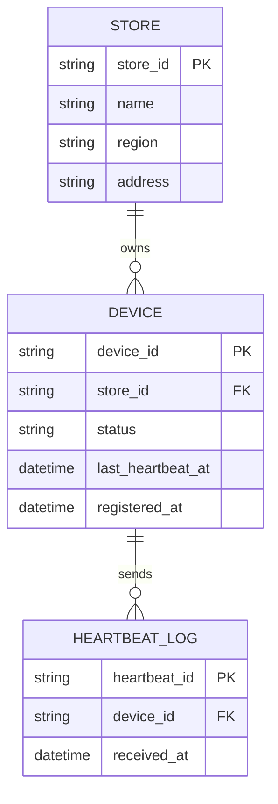

# ERD — Base (trước khi có health check theo lịch hoạt động)

Đây là **base**: mô hình dữ liệu suy luận cho nền tảng quản lý thiết bị POS *trước khi* có yêu cầu health check thông minh theo lịch hoạt động. Đề bài giả định hệ thống đã có sẵn việc đăng ký thiết bị theo từng chi nhánh và cơ chế heartbeat nhị phân online/offline — nếu chưa có DEVICE/STORE/HEARTBEAT thì việc "phân biệt cửa hàng đóng cửa với thiết bị hỏng" sẽ không có nghĩa. ERD base chưa có lịch hoạt động hay phân loại nhiều trạng thái.

