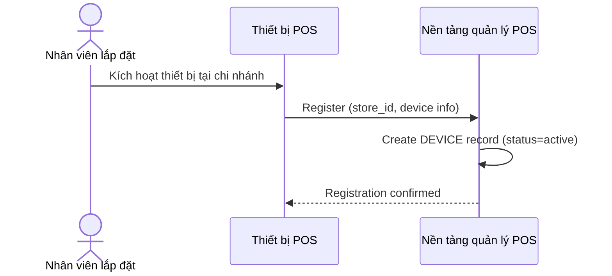

# Sequence Diagram — Base: Register Device

Đây là **base**, flow thiết bị POS đăng ký vào hệ thống khi lắp đặt tại chi nhánh — tiền đề bắt buộc để sau này bổ sung khai báo lịch hoạt động của chi nhánh ngay tại bước đăng ký này.

