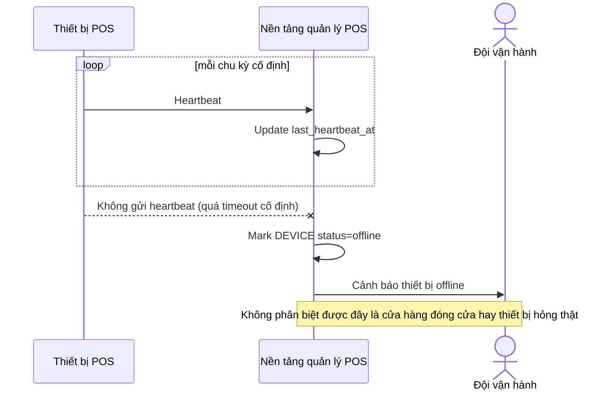

# Sequence Diagram — Base: Heartbeat Check

Đây là **base**, flow heartbeat nhị phân hiện tại — thiết bị im lặng quá ngưỡng timeout cố định thì bị báo động ngay, không phân biệt được cửa hàng đóng cửa bình thường hay thiết bị hỏng thật. Đây chính là điểm sẽ bị thay đổi ở enhance.

